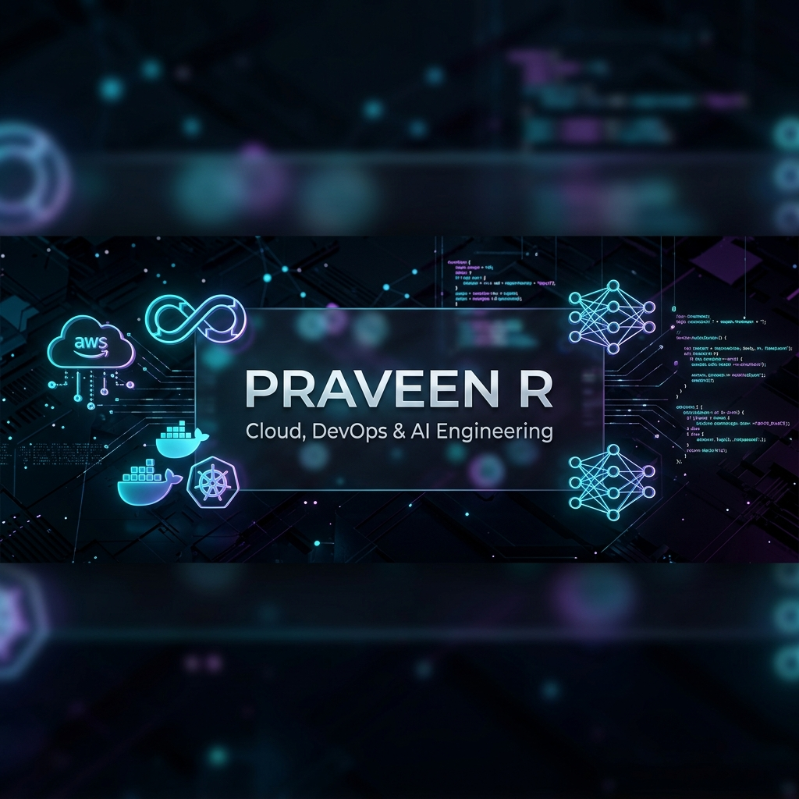

  

<h1 align="center">👋 Hello, I'm Praveen R</h1>

  

  <strong>Building scalable, cloud-native solutions and intelligent pipelines at the intersection of AI, Cloud, and DevOps.</strong>

  
  
  
  

  

---

## 🚀 About Me

I am a highly motivated **Artificial Intelligence & Data Science** student with a deep passion for **Cloud Computing**, **AWS**, **DevOps**, and **Full Stack Development**. I thrive on architecting scalable, resilient systems, automating deployment pipelines, and leveraging AI to build production-ready solutions. 

I actively participate in high-stakes hackathons, tackle algorithmic challenges on LeetCode/CodeChef, and continually expand my knowledge in modern cloud-native architectures. My goal is to bridge the gap between complex software systems and automated, reliable cloud infrastructure.

<table>
  <tr>
    <td width="55%" valign="top">
      <h3>🎯 Career Goals & Interests</h3>
      <ul>
        <li>☁️ <strong>Cloud Infrastructure</strong>: Designing highly available, fault-tolerant, and secure AWS architectures.</li>
        <li>🔄 <strong>DevOps & GitOps</strong>: Implementing CI/CD pipelines, container orchestration, and Infrastructure as Code (IaC).</li>
        <li>🧠 <strong>AI & Data Science</strong>: Building smart integrations, data pipelines, and predictive models.</li>
        <li>💡 <strong>Problem Solving</strong>: Continual algorithm design and complexity optimization.</li>
      </ul>
    </td>
    <td width="45%" valign="top">
      <h3>⚡ Quick Facts</h3>
      <ul>
        <li>📍 <strong>Location</strong>: Tamil Nadu, India</li>
        <li>🎓 <strong>Degree</strong>: B.Tech in AI & Data Science</li>
        <li>💼 <strong>Availability</strong>: Open for Internships & Junior Roles</li>
        <li>🌱 <strong>Currently Reading</strong>: Cloud-native Architecture Patterns</li>
        <li>📫 <strong>Direct Reach</strong>: <a href="mailto:praveen2007.vy@gmail.com">praveen2007.vy@gmail.com</a></li>
      </ul>
    </td>
  </tr>
</table>

---

## 🛠️ Tech Stack & Tooling

### ☁️ Cloud & DevOps (Core Focus)

  
  
  
  
  
  
  

### 💻 Languages & Algorithms

  
  
  
  
  
  

### 🌐 Full Stack Development

  
  
  
  

---

## 🏗️ Featured Projects

<table>
  <tr>
    <td width="50%" valign="top">
      <h3>✈️ Airport Schedule Monitoring System</h3>
      

        
      

      

        A real-time airport schedule monitoring platform featuring role-based access control and an AI-powered passenger notification/update system. Designed for high availability and low latency.
      

      

        <strong>Tech Stack:</strong> React.js, Node.js, Express.js, MongoDB, AI/ML Models
      

      

      

        <a href="https://github.com/praveen2007-VY/airport-schedule-monitoring"><b>📁 GitHub Repository</b></a>
      

    </td>
    <td width="50%" valign="top">
      <h3>📝 Todo List Web Application</h3>
      

        
      

      

        A robust full-stack task management system featuring full CRUD operations, clean RESTful APIs, secure session handling, and responsive user interfaces.
      

      

        <strong>Tech Stack:</strong> React.js, Node.js, Express.js, MongoDB
      

      

      

        <a href="https://github.com/praveen2007-VY/todo-list-app"><b>📁 GitHub Repository</b></a>
      

    </td>
  </tr>
</table>

---

## 🎯 Current Learning & Growth Roadmap

To transition successfully into a **Senior Cloud & AI Engineer**, I am actively pursuing the following milestones:

- 📐 **AWS Certified Solutions Architect (Associate)**: Deepening knowledge of VPCs, IAM, EC2 auto-scaling, RDS, DynamoDB, and Serverless architectures.
- ☸️ **Container Orchestration**: Expanding knowledge of Kubernetes cluster management, Helm charts, and service meshes.
- 🔄 **Continuous Integration/Continuous Deployment (CI/CD)**: Mastering GitHub Actions and Jenkins for automated test execution and cloud deployment.
- 📜 **Infrastructure as Code (IaC)**: Standardizing architecture deployments using Terraform.

---

## 🧠 Competitive Programming & Problem Solving

I love solving algorithmic puzzles to keep my logical reasoning and programming skills sharp.

<table>
  <tr>
    <td width="50%" valign="top">
      <h4>💡 LeetCode Profile</h4>
      <ul>
        <li><strong>Focus Areas</strong>: Dynamic Programming, Graph Algorithms, Arrays, Trees.</li>
        <li><strong>Languages</strong>: C++, Java.</li>
      </ul>
      

        
      

    </td>
    <td width="50%" valign="top">
      <h4>🏆 CodeChef Profile</h4>
      <ul>
        <li><strong>Focus Areas</strong>: Competitive Math, Time/Space Complexity Optimization.</li>
        <li><strong>Participation</strong>: Regular competitor in rated rounds.</li>
      </ul>
      

        
      

    </td>
  </tr>
</table>

---

## 🏆 Hackathons & Key Achievements

- 🥇 **Rank #6 / 500+** in CodeXtreme 24-Hour Hackathon – Co-designed and implemented an intelligent real-time alert engine.
- ⚡ **Participated in 36-Hour Hackathon** – Built a cloud-native prototype focusing on scalable backend integrations.
- 🎓 **Active Problem Solver** – Consistently solving complex computational problems across coding platforms.

---

## 📜 Professional Certifications

- 🏛️ **IBM** | Introduction to Software Engineering
- 🐍 **Microsoft** | Fundamentals of Python
- ☁️ **IBM** | Introduction to Cloud Computing
- 🤖 **IBM** | Artificial Intelligence Essentials

---

## 🤝 Open Source & Collaboration

I believe in the power of collaboration and am keen on contributing to open-source initiatives.
- 🔭 I’m looking to collaborate on **Cloud Infrastructure Automation (Terraform)**, **DevOps utilities (Docker/Kubernetes)**, and **AI-driven web platforms**.
- 💬 Ask me about **AWS, React, Python, or DSA**.
- 📫 How to reach me: Open an issue, or drop an email at [praveen2007.vy@gmail.com](mailto:praveen2007.vy@gmail.com).

---

## 📈 GitHub Activity & Statistics

  
  

  
  

---

  Made with 💻 and ☕ by <b>Praveen R</b>. All rights reserved.  
  <i>"The best way to predict the future is to automate it."</i>

